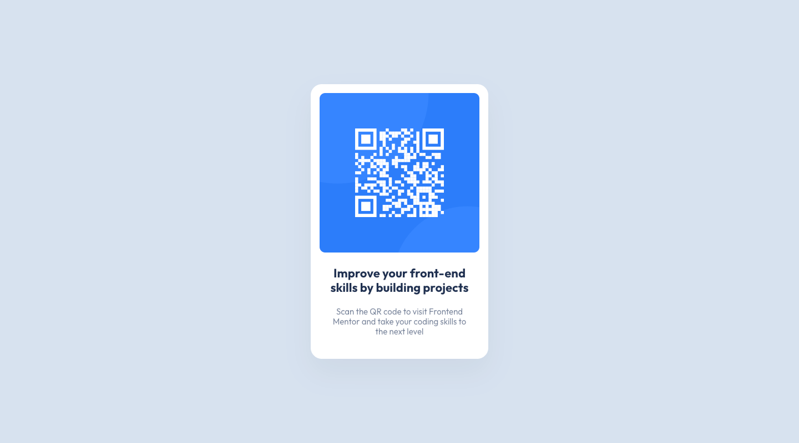
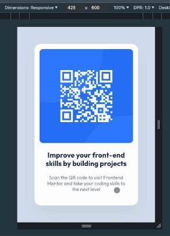

# Frontend Mentor - Stats preview card component solution

This is a solution to the [QR code component challenge on Frontend Mentor](https://www.frontendmentor.io/challenges/qr-code-component-iux_sIO_H).
Frontend Mentor challenges help you improve your coding skills by building realistic projects.

## Table of contents

- [Overview](#overview)
  - [The challenge](#the-challenge)
  - [Screenshot](#screenshot)
  - [Links](#links)
- [My process](#my-process)
  - [Built with](#built-with)
  - [What I learned](#what-i-learned)
  - [Useful resources](#useful-resources)
- [Author](#author)

## Overview

### The challenge

Users should be able to:

- View the optimal layout depending on their device's screen size

### Screenshot



### Links

- Solution URL: [https://github.com/alkersan/qr-code-component](https://github.com/alkersan/qr-code-component)
- Live Site URL: [https://alkersan.github.io/qr-code-component/](https://alkersan.github.io/qr-code-component/)

## My process

### Built with

- Flexbox
- [React](https://react.dev) - JS library
- [Styled Components](https://styled-components.com/) - For CSS
- [Vite](https://vitejs.dev) - Build tool

### What I learned

It was tricky to figure out how to prevent vertical and horizontal content loss on smaller viewports,
e.g. less than 320px. Here's the snippet that worked for me:
```js
const Main = styled.main`
    ...
    min-width: fit-content;
    min-height: 100%;
    
    display: flex;
    justify-content: center;
    align-items: center;
`;

const CardWrapper = styled.div`
    // Don't grow horizontally more than minimally possible to contain the card
    // I guess it works because nested image has fixed dimensions 
    max-width: min-content;
    ...
    img {
        display: block;
        width: 288px;
        height: 288px;
    }
`;
```




### Useful resources

The course [css-for-js](https://css-for-js.dev) helped me immensely. 

## Author

- Frontend Mentor - [@alkersan](https://www.frontendmentor.io/profile/alkersan)
